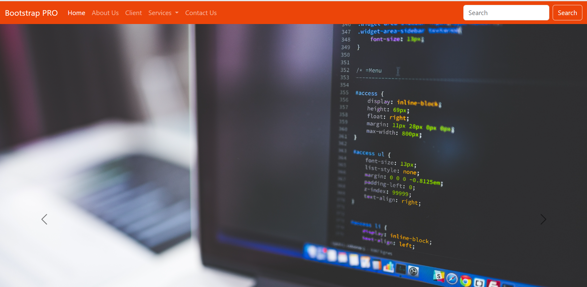
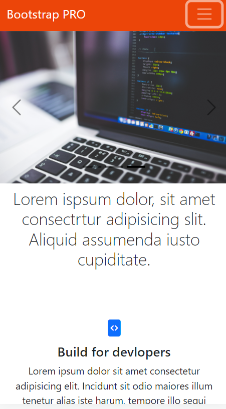
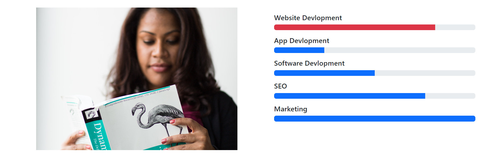
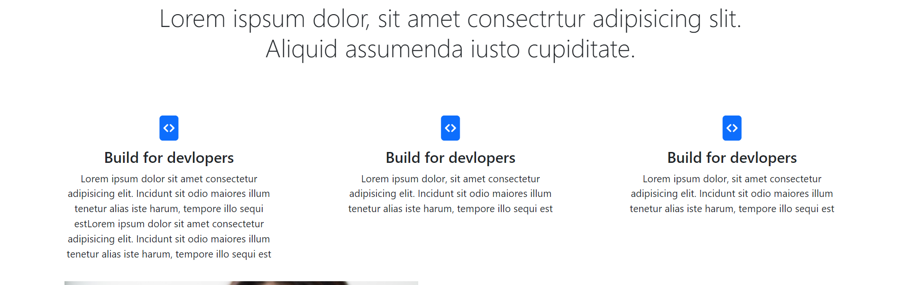

# Font Page using Bootstrap

This project is a font page of a website built using Bootstrap. It utilizes various Bootstrap components to create an engaging and responsive user interface. The following components have been incorporated into the font page:

Navbars: The font page features a responsive navigation menu built with Bootstrap's navbar component. The menu includes dropdowns for easy navigation and enhanced user experience.

Buttons: Bootstrap's button styles and classes have been used to create visually appealing and interactive buttons throughout the font page. The buttons are customizable and responsive.

Dropdowns: Bootstrap's dropdown component is employed to provide additional options and functionality within the font page. The dropdown menus enhance the user interface and improve navigation.

Images: The font page showcases captivating images, leveraging Bootstrap's responsive image classes. The images are optimized for different devices and screen sizes, ensuring a seamless experience.

Grid: Bootstrap's grid system is utilized to structure and organize the layout of the font page. The responsive grid allows for easy alignment and responsiveness across various screen resolutions.

Form: A form section is integrated into the font page using Bootstrap's form components. Users can input data and interact with form elements, creating an interactive and user-friendly experience.

Range: Bootstrap's range input component is employed to provide users with the ability to select values within a specific range. The range inputs enhance user interaction and input flexibility.

Accordion: The font page includes an accordion component, made possible by Bootstrap, which allows content to be displayed in collapsible sections. Users can expand and collapse sections as needed.

The project has been developed with reference to the official Bootstrap documentation, which provides extensive guidance and examples on utilizing these components effectively.

Technologies Used
The font page is built using the following technologies and tools:

HTML
CSS
Bootstrap
